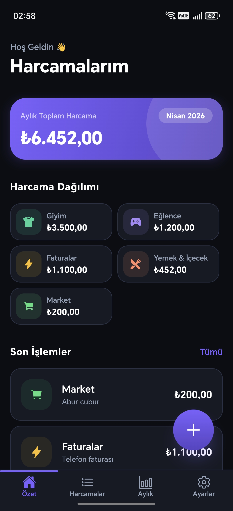

# Harcamalarım


Kişisel harcama takip uygulaması. Günlük ve aylık harcamaları kategorilere göre girebilir, özet ve grafiklerle takip edebilirsin. Tüm veriler cihazda yerel olarak saklanır — sunucu veya internet bağlantısı gerekmez (kur çevrimi hariç).



---

## Teknoloji Stack

| Katman | Teknoloji |
|--------|-----------|
| Framework | React Native + Expo (SDK 54, bare workflow) |
| Navigasyon | Expo Router (file-based) |
| Yerel depolama | AsyncStorage |
| UI bileşenleri | Custom + `@expo/vector-icons` (Ionicons) |
| Gradyanlar | `expo-linear-gradient` |
| Tarih işlemleri | `date-fns` + `@react-native-community/datetimepicker` |
| Döviz kurları | TCMB XML API (gerçek zamanlı, bellek önbellekli) |
| Build | EAS Build (cloud APK) |

---

## Ekranlar

### 1. Özet (Ana Ekran)
- Bu ayki toplam harcama kartı (ay/yıl bilgisiyle)
- Aylık bütçe hedefi ve kullanım çubuğu
- Kategorilere göre harcama dağılımı (2 sütunlu grid)
- Son 5 harcama listesi (tapa → düzenle)
- Harcama ekle butonu (FAB)

### 2. Harcama Ekle
- Tutar girişi (seçili para birimi sembolüyle)
- Para birimi seçimi (₺ / $ / € / £)
- Sistem para birimi farklıysa gerçek zamanlı kur önizlemesi
- Tarih seçimi — iOS: özel bottom sheet modal, Android: native dialog
- 2 sütunlu kategori seçimi (ikonlu)
- Not alanı (opsiyonel)

### 3. Harcama Düzenle
- Add Expense ile aynı tasarım ve özellikler
- Tarih değiştirme
- Sil butonu (onaylı)

### 4. Harcama Geçmişi
- Tarih bazlı gruplama (Bugün / Dün / tarih)
- Bölüm toplamları
- Kategori filtre chip'leri
- Orijinal para birimi farklıysa dönüşüm bilgisi

### 5. Aylık Analiz
- Bu ay toplam harcama + geçen ayla karşılaştırma (% fark, trend ikonu)
- Günlük harcama bar grafiği — bugün ortada açılır, tapa tutar gösterir
- Kural tabanlı otomatik çıkarımlar (her yeni harcamada yenilenir):
  - Kategoride %20+ artış / azalış
  - Bu ay yeni başlayan kategori
  - Tek kategorinin payı %40'ı geçerse uyarı
  - Genel trend (%30+ artış veya %-15 azalış)
  - En sık harcama günü (≥3 işlem)
- Kategori detayları: pay yüzdesi, geçen ayla fark

### 6. Ayarlar
- Sistem para birimi seçimi — değişince tüm harcamalar TCMB kuruyla yeniden hesaplanır
- Aylık bütçe hedefi (switch kapatılınca otomatik sıfırlanır)
- Kategoriler listesi (2 sütunlu grid, ikonlu)
- Tüm verileri temizle
- Tüm kritik işlemler onay modalıyla korunur

---

## Döviz Kuru Sistemi

- Kaynak: TCMB (Türkiye Cumhuriyet Merkez Bankası) ForexSelling kurları
- Hafta sonu / tatil günlerinde geriye doğru en fazla 7 iş günü aranır
- Sonuçlar bellek önbelleğinde tutulur (aynı tarih için tekrar istek atılmaz)
- Ağ hatası durumunda yaklaşık sabit kurlarla devam edilir
- Para birimi değiştirildiğinde tüm geçmiş harcamalar harcama tarihindeki TCMB kuruyla yeniden hesaplanır

---

## Veri Modeli

### Harcama (Expense)
```json
{
  "id": "1713180000000-abc123",
  "amount": 150.50,
  "currency": "₺",
  "convertedAmount": 150.50,
  "exchangeRate": 1,
  "categoryId": "yemek",
  "date": "2026-04-15",
  "note": "Öğle yemeği",
  "createdAt": "2026-04-15T12:30:00.000Z"
}
```

### Kategori (Category)
```json
{
  "id": "yemek",
  "name": "Yemek & İçecek",
  "icon": "restaurant",
  "color": "#FF8C69"
}
```

### Ayarlar (Settings)
```json
{
  "currency": "₺",
  "monthlyBudget": 5000,
  "categories": [ ... ]
}
```

---

## Renk Teması (Koyu)

| Token | Renk | Kullanım |
|-------|------|----------|
| `background` | #0B0D13 | Ana arka plan |
| `surface` | #161A24 | Kart / panel arka planı |
| `surfaceAlt` | #1F2436 | İkincil kart |
| `primary` | #7B61FF | Vurgu rengi (mor) |
| `success` | #00F294 | Pozitif / azalan harcama |
| `danger` | #FF4B6E | Hata / bütçe aşıldı / artan harcama |
| `warning` | #FFB800 | Uyarı |
| `textPrimary` | #FFFFFF | Ana metin |
| `textSecondary` | #94A3B8 | İkincil metin |
| `border` | #2A3045 | Kenarlık |

---

## Kategoriler

| # | Kategori | İkon | Renk |
|---|----------|------|------|
| 1 | Yemek & İçecek | restaurant | #FF8C69 |
| 2 | Market | cart | #4ADE80 |
| 3 | Ulaşım | car | #60A5FA |
| 4 | Faturalar | flash | #FBBF24 |
| 5 | Sağlık | heart | #F472B6 |
| 6 | Eğlence | game-controller | #A78BFA |
| 7 | Giyim | shirt | #34D399 |
| 8 | Kişisel Bakım | sparkles | #FB923C |
| 9 | Eğitim | book | #38BDF8 |
| 10 | Ev & Yaşam | home | #E879F9 |
| 11 | Diğer | ellipsis-horizontal | #94A3B8 |

---

## Proje Dizin Yapısı

```
HarcamalarimMobileApp/
├── app/
│   ├── (tabs)/
│   │   ├── _layout.tsx          # Tab bar
│   │   ├── index.tsx            # Özet (Dashboard)
│   │   ├── expenses.tsx         # Harcama geçmişi
│   │   ├── monthly.tsx          # Aylık analiz
│   │   └── settings.tsx         # Ayarlar
│   ├── add-expense.tsx          # Harcama ekle
│   ├── edit-expense.tsx         # Harcama düzenle / sil
│   └── _layout.tsx              # Root stack
├── services/
│   ├── exchangeRate.ts          # TCMB kur çekme, dönüşüm, önbellekleme
│   └── insights.ts              # Kural tabanlı aylık çıkarım motoru
├── store/
│   └── storage.ts               # AsyncStorage CRUD (Expense, Settings)
├── constants/
│   ├── categories.ts            # 11 varsayılan kategori
│   └── theme.ts                 # Renk paleti, Spacing, Radius, FontSize
└── android/                     # Bare workflow — native Android projesi
```

---

## Kurulum ve Çalıştırma

### Geliştirme
```bash
npm install
npx expo start
```

### Android (bare workflow)
```bash
npx expo run:android
```

### Bağımsız APK (EAS Build)
```bash
npm install -g eas-cli
eas login
eas build -p android --profile preview
```
